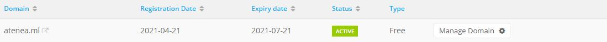
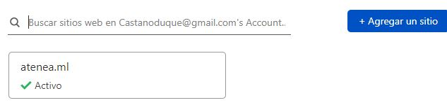
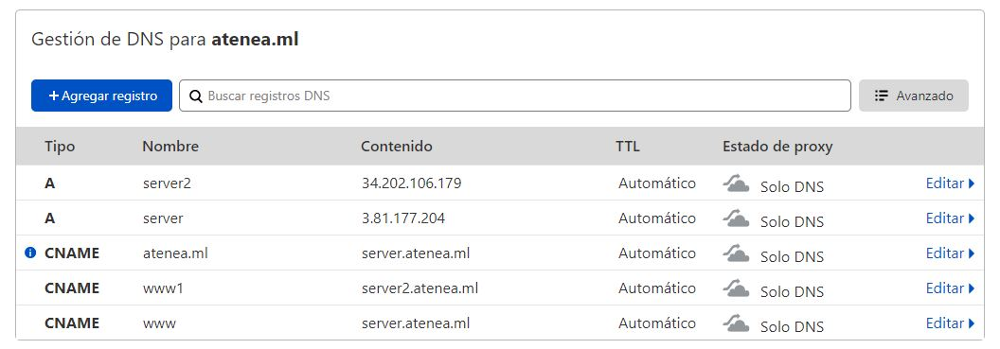
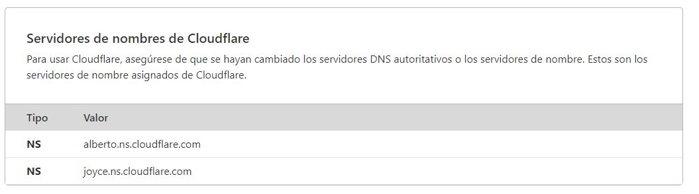
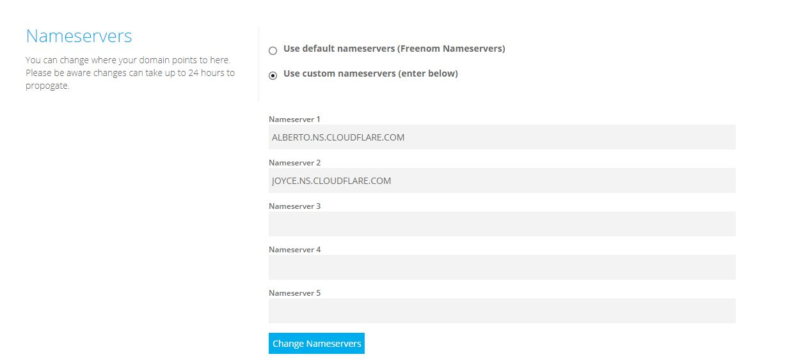
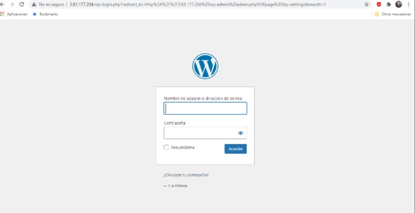
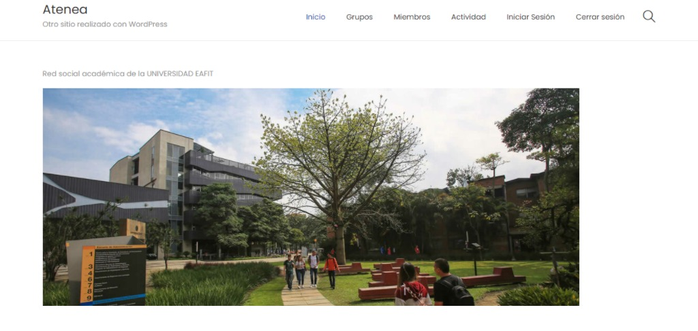
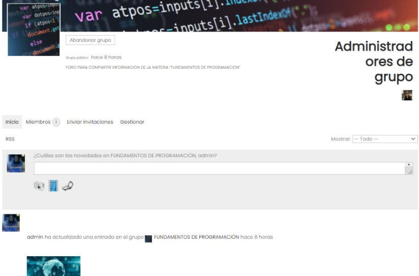
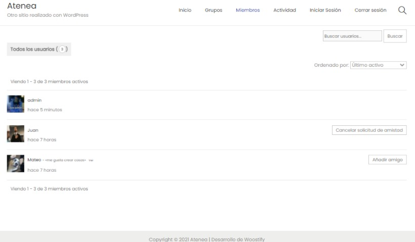

***PROYECTO EN PROGRESO***

# Sistemas escalables
## Primera étapa, sistema monólitico: 

### **Setup de las máquinas virtuales:**

En esta primera étapa, iniciamos creando dos máquinas virtuales (EC2) de manera individual y en estas máquinas desplegar una app básica con wordpress, estas máquina tenían asociadas una IP elástica para evitar que la IP fuese variando con el tiempo y pudiese asociarse adecuadamente a un DNS. También logramos asociarles un certificado SSL a estas máquinas virtuales.

**lastimosamente por razones ajenas, las máquinas dentro del curso fueron canceladas.**

Como estrategia alternativa, creamos nuevamente una máquina virtual para empezar a trabajar en el proyecto, alcanzamos a montarle nuevamente una aplicación wordpress, pero antes de añadirle el certificado SSL, **surgieron nuevos problemas con el acceso a la máquina, aunque esta vez no fue tumbada**, por estos incovenientes no tenemos pruebas de la configuración de la máquina en EC2.

### **Solicitud de dominio y administración del DNS:**

- Teniendo ya una máquina virtual funcionando con wordpress, utilizamos un dominio ofrecido por freenom "atenea.ml"

- Luego de tener el dominio, nos registramos en cloudflare para asociarle este dominio, inicialmente registramos el sitio: 

- Después de tener registrado el dominio, configuramos los registros DNS para que nuestro dominio resolviera la ip elástica de nuestra máquina virtual.

- Finalmente, para poder que clodflare fuera el encargado de administrar este dominio, nos ofrecía dos DNS autoritarios, los cuales cambiamos en freenom, para que quedaran delegados a estos mismos. 

### **Características funcionales:**

A la hora de montar la estructura del WordPress, y pensando en los requisitos de lo que debía ser el sistema, “una comunidad de aprendizaje” en la cual se puedan crear grupos y compartir información entre estudiantes en diferentes materias de interés.

ATENEA implemento una red social de aprendizaje en la cual puedes contar con perfiles, grupos, interacción con otros usuarios, mensajería, entre otras funcionalidades, para esta se utilizó diversos pluggins de WordPress, entre ellos BUDDYPRESS para montar la red social, WOOSTIFY el cual es el tema inicial para que la vista sea un poco más agradable para el usuario, Activity Plus Reloaded for BuddyPress para subir archivos a los grupos y BuddyPress Edit Activity para realizar ediciones a los contenidos subidos previamente.  

Cabe mencionar que estos pluggins son iniciales para esta comunidad de aprendizaje y en futuras entregas se modificaran elementos para perfeccionar funcionalidades 

 

Por problemas de verificación y certificación SSL, por el momento tenemos el login por defecto en WordPress 

Tenemos un menú principal básico

En el menú GRUPOS tenemos los diferentes tipos de grupos creados por usuarios. 

En los grupos podemos visualizar los miembros, administradores del grupo, un apartado de invitar al grupo, y los administradores pueden gestionar el grupo. 
Nota: podemos notar que se pueden subir archivos, videos y fotos al grupo, además del propietario poder editarlos. 

En el apartado miembros tenemos los diferentes usuarios que están en la plataforma, aquí se puede enviar la solicitud de amistad para así interactuar uno con el otro 

En actividad están todas las interacciones que han realizado los usuarios, es algo similar al inicio de FACEBOOK 

**Integrantes:**
- Juan Pablo Castaño Duque: jpcastand@eafit.edu.co
- Mateo Montes Loaiza: mmontesl1@eafit.edu.co

**URL:**
- www.ateneaenterprise.tk

***PROYECTO EN PROGRESO***
